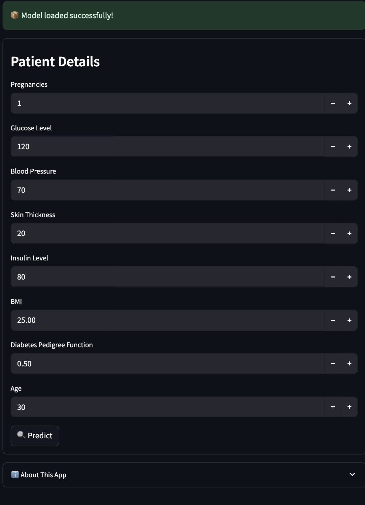
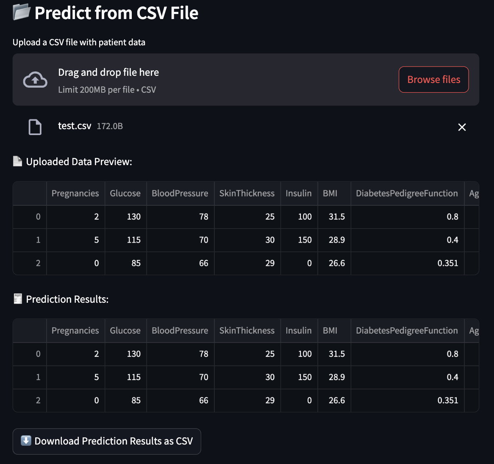

# 🩺 MedPredict - Diabetes Risk Prediction App


MedPredict is a real-time machine learning web application designed to predict the risk of diabetes based on patient medical data. It provides a simple user interface for both manual input and CSV file upload to run predictions using trained ML models.

🔗 **Live App**: [https://medpredict-atqmv6d2gwjoqzanzhema4.streamlit.app](https://medpredict-atqmv6d2gwjoqzanzhema4.streamlit.app)

---

## 🚀 Features

- 🧠 Predict diabetes risk using trained ML models
- 🧾 Input data manually or upload `.csv` for bulk prediction
- 📊 View prediction results instantly
- ⬇️ Download predictions as CSV
- 📈 Compare models (Random Forest, Logistic Regression, KNN) using an accuracy bar chart
- 🎨 Streamlit-based UI with logo placeholder and developer footer

---

## 📂 Sample CSV Format

```
Pregnancies,Glucose,BloodPressure,SkinThickness,Insulin,BMI,DiabetesPedigreeFunction,Age
2,130,78,25,100,31.5,0.8,35
5,115,70,30,150,28.9,0.4,45
0,85,66,29,0,26.6,0.351,31
```

---

## 📁 Project Structure

```
├── app.py
├── diabetes_model.pkl
├── requirements.txt
├── test.csv
├── diabetes.csv
└── README.md
```

---

## 🛠 Tech Stack

- Python
- Streamlit
- Scikit-learn
- Pandas, NumPy
- Matplotlib
- Joblib

---

## 📈 Model Comparison

This app compares the following classifiers using accuracy score:

- ✅ Random Forest
- ✅ Logistic Regression
- ✅ K-Nearest Neighbors (KNN)

---

## 👨‍💻 Developed By

**Kotha Mohan Krishna**  
📧 [alwaysmohankrishnan@gmail.com](mailto:alwaysmohankrishnan@gmail.com)

---

## 📌 Run Locally

```bash
# Clone the repo
git clone https://github.com/mohan-krishna-kotha/medpredict.git
cd medpredict

# Install dependencies
pip install -r requirements.txt

# Run the app
streamlit run app.py
```

---

## 📸 Screenshot

  

